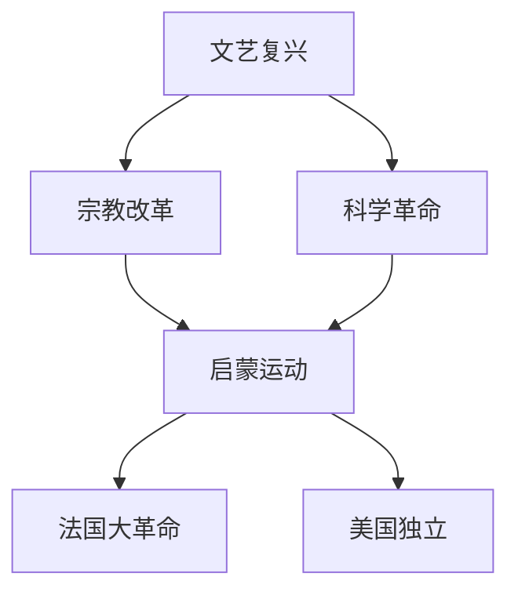

# 历史科目渲染策略文档

## 1. 学科渲染特征概述

历史是K-12阶段以时间线和空间定位为核心的学科，图形需求集中在时间轴、历史地图和关系图。视觉呈现特点包括：
- **时间轴**：朝代更替、重大事件时间线、中外对比时间轴
- **历史地图**：疆域变迁、战争形势图、贸易路线图
- **关系图**：人物关系、因果关系、制度演变
- **排版痛点**：时间轴的比例尺、历史地图的准确性、大量文字材料的层次

## 2. 前端渲染范围（纯文本公式类）

### a. 必须走前端渲染的公式/符号类型

历史学科几乎没有数学公式需求，前端渲染主要处理以下特殊文本：

#### 初中阶段（7-9年级）
- **年代表示**：公元前221年、公元1840年
- **朝代纪年**：无需LaTeX，纯文本
- **基本无公式需求**

#### 高中阶段（10-12年级）
- **历史年代计算**：
  - 公元前后跨度：`$|(-221) - 1912| + 1 = 2134 \text{ 年}$`（注意无公元0年）
- **经济史数据**：
  - 增长率：`$r = \frac{V_2 - V_1}{V_1} \times 100\%$`
- **人口数据**：
  - `$P = 4.5 \times 10^8$`

### b. 标准LaTeX语法示例

```latex
% 年代跨度计算
|(-221) - 1912| + 1 = 2134 \text{ 年}

% 增长率
r = \frac{V_2 - V_1}{V_1} \times 100\%

% 科学计数法
4.5 \times 10^8
```

### c. 前端渲染性能评估

**推荐方案**：HTML + CSS（主力），极少量公式用 KaTeX

**性能特点**：
- 历史学科公式需求极低，几乎可忽略
- 主要挑战在文本排版而非公式渲染

**所需前端宏包**：
- KaTeX 核心库（仅备用）

## 3. 后端渲染范围（复杂图形类）

### a. K-12全学段图形类型穷举

#### 1. 时间轴

**图形类型**：
- 朝代更替时间轴（中国史）
- 世界文明发展时间轴
- 重大事件时间线
- 中外历史对比时间轴
- 专题时间轴（如工业革命进程）

**后端渲染技术栈**：TikZ
```latex
\begin{tikzpicture}
  % 主轴
  \draw[thick, ->] (0,0) -- (14,0);
  % 刻度与事件
  \foreach \x/\year/\event in {
    1/1840/鸦片战争,
    3/1851/太平天国,
    5/1894/甲午战争,
    7/1911/辛亥革命,
    9/1919/五四运动,
    11/1921/中共成立,
    13/1949/新中国成立
  } {
    \draw (\x,0.1) -- (\x,-0.1);
    \node[below, font=\small] at (\x,-0.2) {\year};
    \node[above, font=\small, text width=1.5cm, align=center] at (\x,0.2) {\event};
  }
\end{tikzpicture}
```

#### 2. 历史地图

**图形类型**：
- 中国历代疆域图
- 世界殖民扩张地图
- 战争形势图（如抗日战争、二战）
- 丝绸之路路线图
- 大航海时代航线图
- 工业革命扩展图
- 冷战格局图

**后端渲染技术栈**：TikZ（简化示意图）+ Python matplotlib/Cartopy（精确地图）
```python
import matplotlib.pyplot as plt
import cartopy.crs as ccrs

fig, ax = plt.subplots(subplot_kw={'projection': ccrs.PlateCarree()})
ax.coastlines()
# 标注丝绸之路路线
route_lons = [108, 90, 75, 60, 45, 30]
route_lats = [34, 38, 37, 35, 33, 31]
ax.plot(route_lons, route_lats, 'r-', linewidth=2, transform=ccrs.Geodetic())
plt.savefig('silk_road.png', dpi=150)
```

#### 3. 关系图

**图形类型**：
- 人物关系图
- 因果关系图
- 制度演变图
- 思想流派关系图
- 国际关系格局图

**后端渲染技术栈**：TikZ 或 Mermaid


#### 4. 组织结构图

**图形类型**：
- 封建等级制度图
- 三省六部制结构图
- 近代政治制度对比图
- 联合国组织结构图

**后端渲染技术栈**：TikZ
```latex
\begin{tikzpicture}[
  every node/.style={draw, rectangle, minimum width=2cm, minimum height=0.7cm, font=\small},
  level distance=1.2cm,
  sibling distance=2.5cm
]
\node {皇帝}
  child { node {中书省}
    child { node {吏部} }
    child { node {户部} }
  }
  child { node {门下省} }
  child { node {尚书省}
    child { node {礼部} }
    child { node {兵部} }
    child { node {刑部} }
    child { node {工部} }
  };
\end{tikzpicture}
```

#### 5. 统计图表

**图形类型**：
- 人口变化趋势图
- 经济数据对比图
- 贸易额变化图
- 战争伤亡统计图

**后端渲染技术栈**：pgfplots

#### 6. 对比图表

**图形类型**：
- 中外历史对比表
- 制度对比表
- 思想对比表

**渲染方案**：前端HTML表格（非后端）

#### 7. 文物/遗址示意图

**图形类型**：
- 建筑平面图（如故宫布局）
- 考古遗址分布图

**后端渲染技术栈**：TikZ（简化示意）或预制图片素材

### b. 技术栈选型总结

| 图形类型 | 推荐技术栈 | 备选方案 |
|---------|-----------|---------|
| 时间轴 | TikZ | Mermaid timeline |
| 历史地图 | Python Cartopy | TikZ（简化） |
| 关系图 | Mermaid | TikZ |
| 组织结构图 | TikZ | Mermaid |
| 统计图表 | pgfplots | matplotlib |
| 对比表 | 前端HTML | Markdown table |
| 文物示意 | 预制素材/TikZ | SVG手绘 |

## 4. 边界与特殊情况处理

### 边界情况1：简单年代列举 vs 时间轴
**场景**：
- 简单：题目中提到"1840年、1919年、1949年"
- 复杂：需要可视化的朝代更替时间轴

**决断**：
- **前端渲染**：年代数字（纯文本）
- **后端渲染**：时间轴图形

**理由**：年代数字是文本，时间轴需要比例尺和图形布局。

---

### 边界情况2：简化地图 vs 精确历史地图
**场景**：
- 简化：示意性的疆域轮廓
- 精确：带有城市、河流、边界的详细地图

**决断**：
- **后端渲染（TikZ）**：简化示意地图
- **后端渲染（Python Cartopy）**：精确历史地图

**理由**：精确地图需要GIS数据，TikZ适合概念性示意。

---

### 边界情况3：对比分析表格
**场景**：中国古代政治制度对比（秦朝 vs 唐朝 vs 明朝）

**决断**：
- **前端渲染**：HTML表格

**理由**：结构化文本，无需图形化。

---

### 边界情况4：历史材料中的数据引用
**场景**：材料中出现"1820年中国GDP占世界32.9%"

**决断**：
- **前端渲染**：纯文本

**理由**：数据嵌入在文字材料中。

---

### 边界情况5：战争形势图
**场景**：抗日战争正面战场与敌后战场分布

**决断**：
- **后端渲染**：Python Cartopy 生成带标注的地图

**理由**：需要真实地理坐标和区域填充。

---

### 边界情况6：朝代更替的简单文字 vs 图形
**场景**：
- 文字：`夏 → 商 → 西周 → 东周（春秋、战国）→ 秦`
- 图形：带时间比例尺的朝代时间轴

**决断**：
- **前端渲染**：简单文字箭头序列
- **后端渲染**：带比例尺的时间轴

**理由**：文字序列用 HTML 即可，时间轴需要精确的时间比例。

---

## 5. 架构决策总结

### 前端渲染职责
- 所有文本内容（材料、题目、选项）
- 年代数字
- 简单文字序列（朝代更替文字版）
- 对比分析表格
- 极少量数学公式

### 后端渲染职责
- 时间轴
- 历史地图
- 关系图
- 组织结构图
- 统计图表

### 特殊说明
历史学科的核心渲染挑战是时间轴和历史地图：
1. **时间轴**：需要支持不等比例尺（如公元前跨度大、近代密集）
2. **历史地图**：需要历史疆域数据，建议建立专用的历史地图素材库
3. **关系图**：优先使用 Mermaid，开发效率高于 TikZ

### 技术栈最终选型
- **前端**：HTML + CSS（主力）+ KaTeX（备用）
- **后端**：TikZ（时间轴、结构图）+ Python Cartopy（历史地图）+ Mermaid（关系图）+ pgfplots（统计图表）
- **图片格式**：SVG（时间轴、关系图）+ PNG（地图，@2x）
- **数据源**：历史疆域GIS数据集（如CHGIS中国历史地理信息系统）