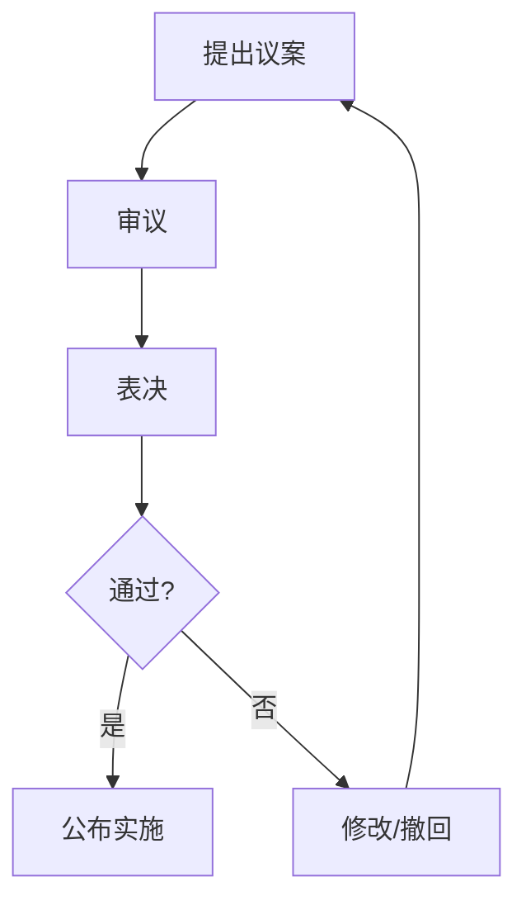

# 政治科目渲染策略文档

## 1. 学科渲染特征概述

政治（道德与法治/思想政治）是K-12阶段以文本论述为主的学科，图形需求集中在逻辑关系的可视化表达。视觉呈现特点包括：
- **文本为主**：大量论述性文字、材料分析
- **逻辑图形**：思维导图、流程图、关系图
- **统计图表**：经济数据图表、社会调查数据
- **排版痛点**：长文本材料的层次结构、知识框架的可视化

## 2. 前端渲染范围（纯文本公式类）

### a. 必须走前端渲染的公式/符号类型

#### 初中阶段（7-9年级，道德与法治）
- **基本无公式需求**，全部为纯文本

#### 高中阶段（10-12年级，思想政治）

**经济学常识**：
- **GDP计算**：`$\text{GDP} = C + I + G + (X - M)$`
- **通货膨胀率**：`$\pi = \frac{P_t - P_{t-1}}{P_{t-1}} \times 100\%$`
- **恩格尔系数**：`$E = \frac{\text{食品支出}}{\text{消费总支出}} \times 100\%$`
- **汇率表示**：`$1 \text{ USD} = 7.2 \text{ CNY}$`
- **利率计算**：`$A = P(1 + r)^n$`
- **税收**：`$\text{应纳税额} = \text{应税所得} \times \text{税率} - \text{速算扣除数}$`
- **供需关系**：`$Q_d = a - bP$`、`$Q_s = c + dP$`

**哲学常识**：
- 基本无公式需求，偶尔出现简单数学表达

### b. 标准LaTeX语法示例

```latex
% GDP
\text{GDP} = C + I + G + (X - M)

% 恩格尔系数
E = \frac{\text{食品支出}}{\text{消费总支出}} \times 100\%

% 通货膨胀率
\pi = \frac{P_t - P_{t-1}}{P_{t-1}} \times 100\%

% 复利
A = P(1 + r)^n
```

### c. 前端渲染性能评估

**推荐前端渲染引擎**：KaTeX

**性能特点**：
- 政治学科公式极少且简单，KaTeX 渲染 < 3ms/公式
- 仅经济学常识模块需要公式渲染

**所需前端宏包**：
- KaTeX 核心库即可

## 3. 后端渲染范围（复杂图形类）

### a. K-12全学段图形类型穷举

#### 1. 思维导图

**图形类型**：
- 知识体系框架图
- 概念关系图
- 哲学原理体系图
- 政治制度结构图

**后端渲染技术栈**：TikZ + mindmap 库
```latex
\begin{tikzpicture}[mindmap, grow cyclic,
  every node/.style={concept, fill=blue!20},
  level 1/.style={level distance=4cm, sibling angle=90},
  level 2/.style={level distance=2.5cm, sibling angle=45}]
  \node{唯物辩证法}
    child { node {联系观}
      child { node {普遍性} }
      child { node {客观性} }
    }
    child { node {发展观}
      child { node {量变质变} }
      child { node {前进性曲折性} }
    }
    child { node {矛盾观}
      child { node {对立统一} }
      child { node {主次矛盾} }
    };
\end{tikzpicture}
```

#### 2. 流程图

**图形类型**：
- 立法流程图
- 政策制定流程
- 民主决策流程
- 经济活动循环图
- 认识论流程（实践→认识→再实践）

**后端渲染技术栈**：TikZ 或 Mermaid


#### 3. 组织结构图

**图形类型**：
- 国家机构体系图
- 政党制度结构图
- 人民代表大会制度图
- 基层群众自治制度图
- 国际组织结构图

**后端渲染技术栈**：TikZ
```latex
\begin{tikzpicture}[
  every node/.style={draw, rectangle, minimum width=3cm, minimum height=0.8cm},
  level distance=1.5cm,
  sibling distance=4cm
]
\node {全国人民代表大会}
  child { node {国务院} }
  child { node {最高人民法院} }
  child { node {最高人民检察院} };
\end{tikzpicture}
```

#### 4. 经济数据图表

**图形类型**：
- GDP增长趋势图
- CPI变化折线图
- 产业结构饼图
- 进出口贸易柱状图
- 居民收入分配图

**后端渲染技术栈**：pgfplots
```latex
\begin{tikzpicture}
\begin{axis}[
  xlabel={年份},
  ylabel={GDP增长率/\%},
  xtick={2018,2019,2020,2021,2022,2023},
  grid=major
]
\addplot[blue, thick, mark=*] coordinates {
  (2018,6.7) (2019,6.0) (2020,2.2) (2021,8.4) (2022,3.0) (2023,5.2)
};
\end{axis}
\end{tikzpicture}
```

#### 5. 关系图

**图形类型**：
- 供需关系图
- 价值规律图
- 社会基本矛盾关系图
- 文化与经济政治关系图

**后端渲染技术栈**：TikZ

#### 6. 漫画/讽刺画（题目配图）

**图形类型**：
- 时政漫画
- 讽刺画

**渲染方案**：预制图片素材（非程序化生成）

### b. 技术栈选型总结

| 图形类型 | 推荐技术栈 | 备选方案 |
|---------|-----------|---------|
| 思维导图 | TikZ mindmap | Mermaid |
| 流程图 | Mermaid | TikZ |
| 组织结构图 | TikZ | Mermaid |
| 经济数据图 | pgfplots | matplotlib |
| 关系图 | TikZ | D3.js → PNG |
| 漫画配图 | 预制素材 | - |

## 4. 边界与特殊情况处理

### 边界情况1：简单经济公式 vs 经济图表
**场景**：`$\text{GDP} = C + I + G + (X-M)$` vs GDP增长趋势图

**决断**：
- **前端渲染**：公式
- **后端渲染**：图表

**理由**：公式是文本，图表需要坐标轴。

---

### 边界情况2：简单层级关系 vs 复杂思维导图
**场景**：
- 简单：`经济基础 → 上层建筑`
- 复杂：唯物辩证法完整知识体系

**决断**：
- **前端渲染**：简单线性关系（用文字箭头 → 表示）
- **后端渲染**：多层级思维导图

**理由**：线性关系用文本即可，多层级需要图形布局。

---

### 边界情况3：表格形式的对比分析
**场景**：唯物主义与唯心主义对比表

**决断**：
- **前端渲染**：HTML表格

**理由**：结构化文本，无需图形化。

---

### 边界情况4：供需曲线图
**场景**：价格与供需关系的交叉曲线

**决断**：
- **后端渲染**：使用 pgfplots

**理由**：需要精确的坐标轴和曲线交点。

---

### 边界情况5：时政材料中的数据
**场景**：材料中引用"2023年我国GDP增长5.2%"

**决断**：
- **前端渲染**：纯文本

**理由**：数据嵌入在文字中，无需特殊渲染。

---

## 5. 架构决策总结

### 前端渲染职责
- 所有文本内容（材料、题目、选项）
- 经济学简单公式
- 简单层级关系（文字箭头）
- 对比分析表格

### 后端渲染职责
- 思维导图
- 流程图
- 组织结构图
- 经济数据图表
- 关系图

### 特殊说明
政治学科约80%的内容为纯文本，后端渲染需求集中在知识体系可视化和经济数据图表。建议：
1. 建立政治学科常用思维导图模板库
2. 经济数据图表支持动态数据输入
3. 流程图优先使用 Mermaid（开发效率高）

### 技术栈最终选型
- **前端**：HTML + CSS（主力）+ KaTeX（经济公式）
- **后端**：Mermaid（流程图）+ TikZ（思维导图、结构图）+ pgfplots（数据图表）
- **图片格式**：SVG（优先）+ PNG