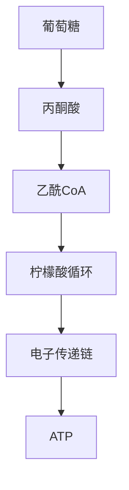

# 生物科目渲染策略文档

## 1. 学科渲染特征概述

生物是K-12阶段图形依赖度最高的学科之一，大量知识点需要通过结构图、流程图、遗传图谱等可视化方式呈现。视觉呈现特点包括：
- **结构图**：细胞结构、器官结构、组织结构
- **流程图**：代谢过程、信号传导、生态系统能量流动
- **遗传图谱**：家系图、基因图谱、染色体图
- **排版痛点**：生物结构图的精细标注、遗传图谱的规范符号、流程图的层次关系

## 2. 前端渲染范围（纯文本公式类）

### a. 必须走前端渲染的公式/符号类型

#### 初中阶段（7-8年级）
- **基本生物学符号**：无复杂公式需求，主要为文字描述

#### 高中阶段（10-12年级）
- **遗传学符号**：
  - 基因型：`$Aa$`、`$AaBb$`、`$X^HX^h$`
  - 表现型比：`$3:1$`、`$9:3:3:1$`
  - 基因频率：`$p + q = 1$`、`$p^2 + 2pq + q^2 = 1$`（Hardy-Weinberg）
- **分子生物学**：
  - DNA碱基配对：`$A-T$`、`$G \equiv C$`
  - 中心法则表达：`$\text{DNA} \xrightarrow{\text{转录}} \text{RNA} \xrightarrow{\text{翻译}} \text{蛋白质}$`
- **生态学公式**：
  - 种群增长：`$N_t = N_0 \cdot \lambda^t$`
  - 逻辑斯谛增长：`$\frac{dN}{dt} = rN\frac{K-N}{K}$`
  - 能量传递效率：`$\eta = \frac{E_{n+1}}{E_n} \times 100\%$`
- **光合与呼吸**：
  - 光合作用总反应：`$\ce{6CO2 + 6H2O ->[\text{光}] C6H12O6 + 6O2}$`
  - 有氧呼吸：`$\ce{C6H12O6 + 6O2 -> 6CO2 + 6H2O}$`
  - 净光合速率：`$P_{\text{净}} = P_{\text{总}} - R$`
- **溶液浓度**：
  - 质壁分离条件：`$c_{\text{外}} > c_{\text{内}}$`

### b. 标准LaTeX语法示例

```latex
% 遗传学
Aa, AaBb, X^HX^h
p^2 + 2pq + q^2 = 1

% 种群生态
N_t = N_0 \cdot \lambda^t
\frac{dN}{dt} = rN\frac{K-N}{K}

% 化学方程式（使用 mhchem）
\ce{6CO2 + 6H2O ->[\text{光}] C6H12O6 + 6O2}

% 中心法则
\text{DNA} \xrightarrow{\text{转录}} \text{RNA} \xrightarrow{\text{翻译}} \text{蛋白质}

% 比例
3:1, 9:3:3:1
```

### c. 前端渲染性能评估

**推荐前端渲染引擎**：KaTeX + mhchem

**性能特点**：
- 生物公式数量少、复杂度低，KaTeX 渲染极快
- 化学方程式部分需要 mhchem 支持

**所需前端宏包**：
- **mhchem**：光合作用、呼吸作用等化学方程式
- **amsmath**：箭头标注（`\xrightarrow`）

## 3. 后端渲染范围（复杂图形类）

### a. K-12全学段图形类型穷举

#### 1. 细胞结构图

**图形类型**：
- 动物细胞结构图（细胞膜、细胞核、线粒体、内质网、高尔基体等）
- 植物细胞结构图（含细胞壁、叶绿体、液泡）
- 原核细胞结构图
- 细胞器放大图
- 细胞膜流动镶嵌模型

**后端渲染技术栈**：TikZ
```latex
\begin{tikzpicture}
  % 细胞膜
  \draw[thick] (0,0) ellipse (3 and 2);
  % 细胞核
  \draw[thick, fill=blue!10] (0,0) ellipse (1 and 0.8);
  \draw (0,0) node {细胞核};
  % 线粒体
  \draw[fill=red!20] (1.5,1) ellipse (0.5 and 0.3);
  \draw (1.5,1) node[font=\tiny] {线粒体};
\end{tikzpicture}
```

#### 2. 遗传图谱

**图形类型**：
- 家系图（遗传系谱图）
- 基因在染色体上的位置图
- 减数分裂过程图
- 有丝分裂过程图
- 交叉互换示意图

**后端渲染技术栈**：TikZ
```latex
% 家系图
\begin{tikzpicture}
  % 正方形=男性，圆形=女性，填充=患者
  \draw (0,2) rectangle (0.6,2.6);  % 父亲
  \draw (2,2.3) circle (0.3);  % 母亲
  \draw (0.6,2.3) -- (1.7,2.3);  % 婚配线
  \draw (1.15,2.3) -- (1.15,1);  % 后代线
  \draw[fill=black] (1.15,0.7) circle (0.3);  % 患病女儿
\end{tikzpicture}
```

#### 3. 代谢流程图

**图形类型**：
- 光合作用光反应与暗反应流程
- 有氧呼吸三个阶段流程
- 蛋白质合成流程（转录、翻译）
- 细胞信号传导通路
- 免疫应答流程

**后端渲染技术栈**：TikZ 或 Mermaid


#### 4. 生态系统图

**图形类型**：
- 食物链与食物网
- 能量金字塔
- 碳循环示意图
- 氮循环示意图
- 种群增长曲线（J型、S型）

**后端渲染技术栈**：TikZ + pgfplots（增长曲线）

#### 5. 人体器官与系统图

**图形类型**：
- 消化系统示意图
- 循环系统（心脏结构）
- 呼吸系统
- 神经系统（突触结构）
- 内分泌系统
- 肾单位结构图

**后端渲染技术栈**：TikZ（简化示意图）

#### 6. 分子结构图

**图形类型**：
- DNA双螺旋结构
- RNA结构
- 蛋白质四级结构示意
- 磷脂双分子层
- ATP结构

**后端渲染技术栈**：TikZ + chemfig

#### 7. 实验结果图

**图形类型**：
- 电泳图谱
- 显微镜观察图
- 实验数据曲线图

**后端渲染技术栈**：pgfplots

### b. 技术栈选型总结

| 图形类型 | 推荐技术栈 | 备选方案 |
|---------|-----------|---------|
| 细胞结构图 | TikZ | SVG手绘 |
| 遗传图谱 | TikZ | Mermaid |
| 代谢流程图 | Mermaid | TikZ |
| 生态系统图 | TikZ + pgfplots | matplotlib |
| 人体器官图 | TikZ（简化） | 预制SVG素材库 |
| 分子结构 | TikZ + chemfig | RDKit |
| 实验结果图 | pgfplots | matplotlib |

## 4. 边界与特殊情况处理

### 边界情况1：遗传学比例表达
**场景**：`$F_2$ 表现型比为 $3:1$`

**决断**：
- **前端渲染**：纯文本比例

**理由**：简单数字比例，无需图形化。

---

### 边界情况2：遗传系谱图
**场景**：家系图中的方形、圆形、填充等符号

**决断**：
- **后端渲染**：完整家系图

**理由**：家系图有严格的符号规范（方形=男性、圆形=女性、填充=患者），需要精确的位置关系。

---

### 边界情况3：简单流程图 vs 复杂代谢图
**场景**：
- 简单：`DNA → RNA → 蛋白质`
- 复杂：光合作用完整流程

**决断**：
- **前端渲染**：简单线性流程（用 `\xrightarrow{}` 表示）
- **后端渲染**：复杂分支流程图

**理由**：线性流程可用LaTeX箭头表示，分支流程需要图形布局。

---

### 边界情况4：种群增长曲线
**场景**：J型曲线和S型曲线

**决断**：
- **后端渲染**：使用 pgfplots 生成

**理由**：曲线形状需要精确的数学函数绘制。

---

### 边界情况5：细胞分裂过程图
**场景**：有丝分裂各时期的染色体行为

**决断**：
- **后端渲染**：每个时期单独生成图片

**理由**：染色体的形态、位置需要精确控制。

---

## 5. 架构决策总结

### 前端渲染职责
- 遗传学符号与基因型
- 简单化学方程式（光合、呼吸）
- 种群生态学公式
- 简单线性流程表达

### 后端渲染职责
- 所有细胞结构图
- 遗传系谱图
- 复杂代谢流程图
- 生态系统示意图
- 人体器官结构图
- 分子结构图
- 实验结果图

### 特殊说明
生物学科的图形需求远大于公式需求，后端渲染工作量占比约 70%。建议建立生物学科专用的TikZ模板库，包含常用细胞器、遗传符号等预制组件。

### 技术栈最终选型
- **前端**：KaTeX + mhchem
- **后端**：TeX Live + TikZ + Mermaid + pgfplots + chemfig
- **图片格式**：SVG（结构图）+ PNG（复杂图形）
- **素材库**：建立生物学科专用TikZ组件库