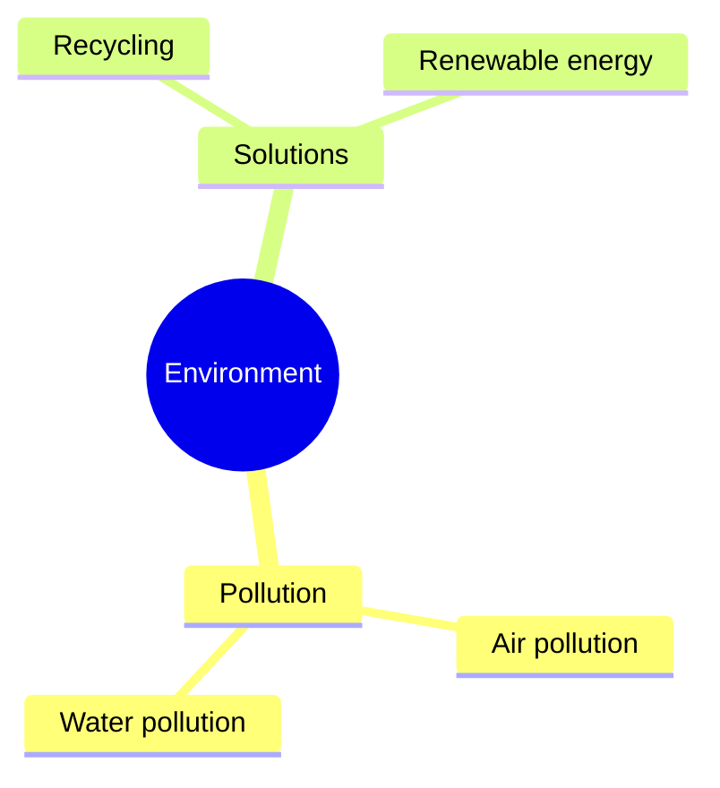

# 英语科目渲染策略文档

## 1. 学科渲染特征概述

英语是K-12阶段公式需求最低的学科，主要以纯文本为主。视觉呈现特点包括：
- **文本为主**：阅读理解、完形填空、语法填空等均为纯文本
- **表格需求**：时态对比表、词性变化表、成绩统计表
- **音标符号**：国际音标（IPA）的正确渲染
- **排版痛点**：音标字体支持、长文本排版、对话格式、诗歌格式

## 2. 前端渲染范围（纯文本公式类）

### a. 必须走前端渲染的公式/符号类型

#### 小学阶段（3-6年级）
- **基本无公式需求**，主要为纯文本和图片

#### 初中阶段（7-9年级）
- **国际音标（IPA）**：
  - 元音：/iː/, /ɪ/, /e/, /æ/, /ɑː/, /ɒ/, /ɔː/, /ʊ/, /uː/, /ʌ/, /ɜː/, /ə/
  - 辅音：/p/, /b/, /t/, /d/, /k/, /g/, /f/, /v/, /θ/, /ð/, /s/, /z/, /ʃ/, /ʒ/
  - 双元音：/eɪ/, /aɪ/, /ɔɪ/, /aʊ/, /əʊ/, /ɪə/, /eə/, /ʊə/
- **重音标记**：/ˈ/ (主重音), /ˌ/ (次重音)
  - 示例：/ˈdɪkʃənri/ (dictionary)

#### 高中阶段（10-12年级）
- **音标同上**，复杂度不增加
- **语法标注**：无需LaTeX，使用HTML标注即可

### b. 标准渲染方案

```html
<!-- 音标渲染：使用 Unicode IPA 字符 + 专用字体 -->
<span class="ipa">/ˈdɪkʃənri/</span>

<!-- CSS 配置 -->
<style>
.ipa {
  font-family: 'Doulos SIL', 'Charis SIL', 'Gentium', serif;
  font-size: 1.1em;
}
</style>
```

**注意**：英语科目的音标不使用LaTeX渲染，而是使用Unicode IPA字符配合专用字体。

### c. 前端渲染性能评估

**推荐方案**：纯HTML + CSS + Unicode

**性能特点**：
- 无需LaTeX引擎，渲染速度等同于普通文本
- 音标使用Unicode字符，无需特殊渲染引擎

**所需前端资源**：
- **IPA字体**：Doulos SIL 或 Charis SIL（Web Font）
- **无需KaTeX/MathJax**

## 3. 后端渲染范围（复杂图形类）

### a. K-12全学段图形类型穷举

英语科目的图形需求极少，主要集中在以下几类：

#### 1. 表格

**表格类型**：
- 时态对比表
- 词性变化表
- 阅读理解信息提取表
- 成绩/数据统计表
- 日程表/课程表

**渲染方案**：前端HTML表格（非后端）
```html
<table class="grammar-table">
  <thead>
    <tr>
      <th>时态</th>
      <th>结构</th>
      <th>示例</th>
    </tr>
  </thead>
  <tbody>
    <tr>
      <td>一般现在时</td>
      <td>S + V(s/es)</td>
      <td>He plays football.</td>
    </tr>
    <tr>
      <td>现在进行时</td>
      <td>S + am/is/are + V-ing</td>
      <td>He is playing football.</td>
    </tr>
  </tbody>
</table>
```

#### 2. 图片类（阅读理解配图）

**图片类型**：
- 阅读理解文章配图
- 看图写话/看图说话
- 地图/路线图（问路题）
- 海报/广告/通知（应用文）

**渲染方案**：直接使用预制图片素材，非程序化生成

#### 3. 思维导图（高中写作）

**图形类型**：
- 写作提纲思维导图
- 词汇关联图

**后端渲染技术栈**：Mermaid（如需程序化生成）


### b. 技术栈选型总结

| 图形类型 | 推荐技术栈 | 备选方案 |
|---------|-----------|---------|
| 表格 | 前端HTML table | Markdown table |
| 配图 | 预制图片素材 | AI生成 |
| 思维导图 | Mermaid | TikZ |
| 路线图 | 预制图片/SVG | TikZ |

## 4. 边界与特殊情况处理

### 边界情况1：音标渲染方式选择
**场景**：题目中出现音标 /ˈdɪkʃənri/

**决断**：
- **前端渲染**：使用Unicode IPA字符 + 专用字体
- **不使用LaTeX**

**理由**：
- IPA符号有完整的Unicode编码
- LaTeX渲染音标反而增加复杂度
- 专用字体（Doulos SIL）渲染效果更好

---

### 边界情况2：语法结构标注
**场景**：句子成分分析（主语、谓语、宾语标注）

**决断**：
- **前端渲染**：使用HTML + CSS下划线/颜色标注

```html
<span class="subject">The boy</span>
<span class="predicate">is reading</span>
<span class="object">a book</span>.
```

**理由**：纯文本标注，无需图形化。

---

### 边界情况3：完形填空的空格渲染
**场景**：文章中的填空位置

**决断**：
- **前端渲染**：使用HTML下划线

```html
The boy went to the <span class="blank">________</span> to buy some milk.
```

**理由**：纯CSS样式即可实现。

---

### 边界情况4：听力题的音频关联
**场景**：听力题需要关联音频文件

**决断**：
- **前端渲染**：HTML5 `<audio>` 标签

```html
<audio controls>
  <source src="/audio/listening_01.mp3" type="audio/mpeg">
</audio>
```

**理由**：浏览器原生支持音频播放。

---

### 边界情况5：阅读理解中的图表
**场景**：阅读理解文章中嵌入统计图表

**决断**：
- **后端渲染**：如果是数据图表（柱状图、折线图）
- **前端渲染**：如果是简单表格

**理由**：数据图表需要精确的坐标轴和比例。

---

## 5. 架构决策总结

### 前端渲染职责
- 所有文本内容
- 音标（Unicode + 专用字体）
- 表格（HTML table）
- 语法标注（CSS样式）
- 填空格式
- 音频播放

### 后端渲染职责
- 极少量的数据图表（如阅读理解中的统计图）
- 思维导图（如需程序化生成）

### 特殊说明
英语科目是所有学科中后端渲染需求最低的，约95%的内容可通过前端纯文本+CSS完成。核心挑战在于：
1. IPA字体的跨平台一致性
2. 长文本的排版美观性
3. 对话格式的缩进与标点

### 技术栈最终选型
- **前端**：HTML + CSS（主力）+ Unicode IPA
- **字体**：Doulos SIL / Charis SIL（IPA专用）
- **后端**：仅在极少数图表场景使用 pgfplots
- **图片格式**：PNG（配图素材）